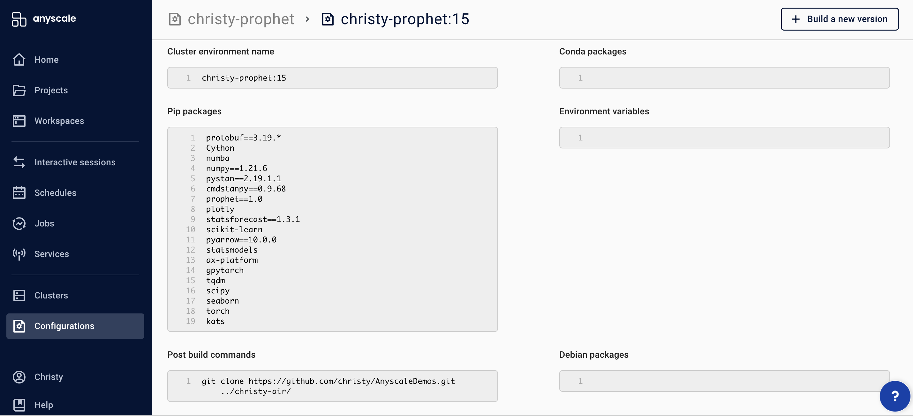
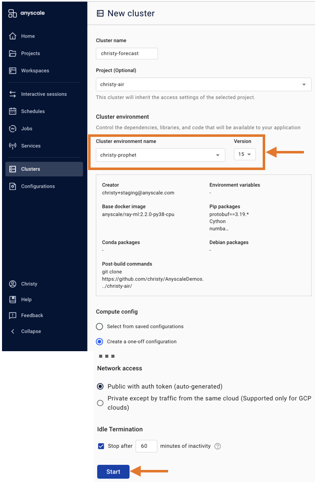
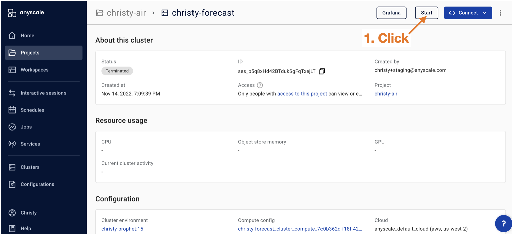

# forecasting_demos

**[Multi-model training, tuning, and serving](https://www.anyscale.com/blog/training-one-million-machine-learning-models-in-record-time-with-ray)** are common tasks in machine learning. They require training and tuning multiple models, on the same or different data segments.  The data segments typcially correspond to different locations, products, or groups of locations or products, etc. Using distributed compute to train hundreds or thousands of models takes less time than traditional Python because the data and model training/tuning/inferencing can be split up into batches and run in parallel! 

These notebooks demonstrate how to use [Ray v2](https://docs.ray.io/en/latest/) for quick and easy distributed forecasting - a special case of multi-model training, tuning, inferencing, and prediction. You will learn how to convert existing code so it can run in parallel on multiple compute nodes.  The compute can be cores on your laptop or clusters in the cloud.

Ray can be used with **any AI/ML Python library**!  But, in these notebooks, we will demo:
- [ARIMA](https://en.wikipedia.org/wiki/Autoregressive_integrated_moving_average)
  - auto.arima() from [pmdarima](https://pypi.org/project/pyramid-arima/)
  - AutoARIMA() from [statsforecast](https://github.com/Nixtla/statsforecast)
- [Prophet](https://facebook.github.io/prophet/)
- [Kats](https://github.com/facebookresearch/Kats)
- [PyTorch Forecasting](https://pytorch-forecasting.readthedocs.io/en/stable/) which uses [PyTorch Lightning](https://pytorch-lightning.readthedocs.io/en/latest/) and the [Ray plug-in for PyTorch Lightning](https://github.com/ray-project/ray_lightning?ref=pythonrepo.com).
  - We will try Google's [Temporal Fusion Transformer](https://github.com/google-research/google-research/tree/master/tft) which was implemented in PyTorch Forecasting.

### 📖 Outline of Notebooks

| Module| Notebook | Description
|:-----|:-----------|:----------------------------------------------------------|
| 1  | [Batch tuning ARIMA+Prophet](https://github.com/christy/AnyscaleDemos/blob/main/forecasting_demos/Ray_v2/train_prophet_blog.ipynb)| Multi-model training+tuning using AutoARIMA() and Prophet algorithms and Ray AIR APIs |
| 2 | [Batch tuning+deployment Temporal Fusion Transformer](https://github.com/christy/AnyscaleDemos/blob/main/forecasting_demos/Ray_v2/ray_air/pytorch_forecasting.ipynb) | Multi-model larger models training+tuning+deployment using Google's Temporal Fusion Transformer algorithm in PyTorch Forecasting which uses Ray Lightning plug-in for Pytorch Lightning.  Deploy using Ray Serve. |
| 3 | [Ray multiprocessing Prophet](https://github.com/christy/AnyscaleDemos/blob/main/forecasting_demos/Ray_v2/train_prophet_blog.ipynb)| Multi-model training using Ray Multiprocessing which is an easier replacement for Ray Core APIs. |
| 4 | [Batch training ARIMA](https://github.com/christy/AnyscaleDemos/blob/main/forecasting_demos/Ray_v2/ray_core/nyctaxi_arima_simple_SMALL_data.ipynb)| Multi-model training using AutoARIMA() and Ray Core. |
| 5 | [Batch training Prophet](https://github.com/christy/AnyscaleDemos/blob/main/forecasting_demos/Ray_v2/ray_core/nyctaxi_prophet_simple_SMALL_data.ipynb)| Multi-model training using Prophet and Ray Core. |
| 6 | [Batch training using Ray v1](https://github.com/christy/AnyscaleDemos/tree/main/forecasting_demos/Ray_v1/ray_core)| Older versions of above notebooks using Ray Core v1. |

 
  
# Data

These notebooks use the public NYC Taxi rides dataset. 

- Raw data original source: https://www1.nyc.gov/site/tlc/about/tlc-trip-record-data.page

- Raw data hosted publicly on AWS:  s3://anonymous@air-example-data/ursa-labs-taxi-data/by_year/

- 8 months of cleaned data in this repo under folder data/

 

# 👩 Setup Instructions for Anyscale

We recommend running Ray on [Anyscale](https://console.anyscale.com) to take full advantage of developing on a personal laptop, then quickly spinning up resources in a cloud to run your same laptop code on bigger compute resources. (Get the [invite code here](https://www.anyscale.com/signup) and follow [the instructions](https://docs.anyscale.com/user-guide/develop-and-debug/workspaces#workspaces-tutorial)to set up with your cloud account.)
 

To configure an Anyscale cluster `Configuration`, use the **[latest Ray](https://github.com/ray-project/ray)** (right now it is v2.2) on a **Python 3.8 ML** docker image, example `anyscale/ray-ml:2.2.0-py38-gpu`.  Don't worry, you can on-the-fly remove the GPU per cluster just before you spin one up, if you don't need expensive GPU.  'ml' docker image means standard ml libraries automatically installed, e.g. pandas, matplotlib.  Python3.8 is important!  Since, at the time of writing this, Prophet still has this dependency.

## The first time you configure your cluster:
<ol>
<li>In your browser, open `console.anyscale.com`.  
<li>Click on `Configurations` > `Create a new environment`. 
<li>Give the configuration a name example `myname-forecasting`.
<li>Select a base docker image, example `anyscale/ray-ml:2.2.0-py38-gpu`.
<li>Specify `Pip packages` in this order:
<ul>
protobuf 
Cython 
numba 
numpy==1.21.6 
pystan==2.19.1.1 
cmdstanpy==0.9.68 
prophet==1.0 
plotly 
statsforecast==1.3.1 
scikit-learn 
pyarrow==10.0.0 
statsmodels 
ax-platform 
seaborn 
kats 
For PyTorch Forecasting add these:  
ray_lightning 
pytorch-forecasting 
mlflow 
</ul>
<li>For PyTorch Forecasting specify `Conda packages` in this order:
<ul>
tqdm 
grpcio-tools 
tensorflow 
tensorboardx 
</ul>
<li>Put your github repo in the `Post build commands` section:
   <ul>
   <li>If you have a project name:
      <ul>
      <li>git clone your-git-repo-url ../your-project-name/
      </ul>
   <li>Otherwise if you do not have a project:
      <ul>
      <li>git clone your-git-repo-url
      </ul>
   </ul>
<li>Click 'Create'.
</ol>

 

## The first time you spin up a cluster:
<ol>
<li>In your browser, open `console.anyscale.com`.  
<li>Click on `Clusters` > `Create`. 
<li>Give the cluster a name.
<li>Select a project that the cluster belongs to.
<li>Select the latest cluster environment name that you just created, example `myname-forecasting` and latest version.
<li>Leave the default radio button on `Compute config` = `Create a one-off configuration`.
<li>Select a default cloud config from your organization, e.g. AWS, region=us-west-2, zones=any.
<li>Node types.  Here is where you can delete the GPU if you are not going to use it, example Remove `g4dn.4xlarge`.  You can also specify min/max number of worker node clusters, memory, and AWS spot instances option here.
<li>Click `Start`.
<li>Wait until the cluster is ready, then click `Jupyter` button.
</ol>

Anyscale by default will automatically shut down your cluster for you after 2 hours of inactivity.  That way you don't have to worry about accidentally leaving it running over a weekend.

 

## From now on, whenever you want to spin up a cluster, it will be quicker:
<ul>
<li>In your browser, open `console.anyscale.com`.  
<li>Click on `Clusters` > `Created by me`. 
<li>Click on the cluster.
<li>Click `Start`.
<li>Wait until the cluster is ready, then click `Jupyter` button.
</ul>

 

🎓 To further speed up your development process (especially convenient if you are contributing to open-source Ray), use [Anyscale Workspaces](https://docs.anyscale.com/user-guide/develop-and-debug/workspaces#workspaces-tutorial), to develop and save your code directly on a cloud, instead of on your laptop!

 

Let's have fun 😜 and Thank you 🙏. 
